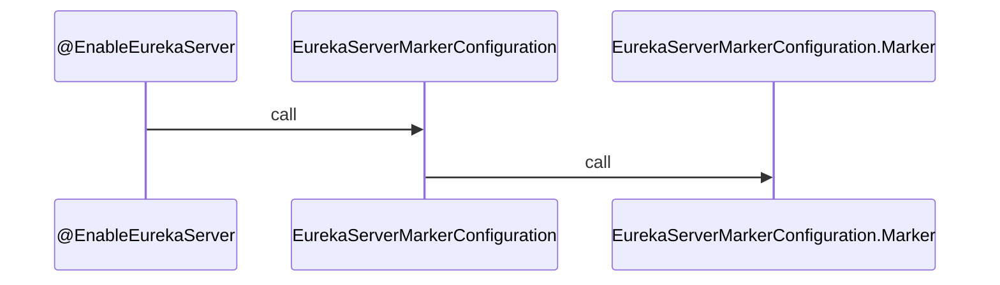
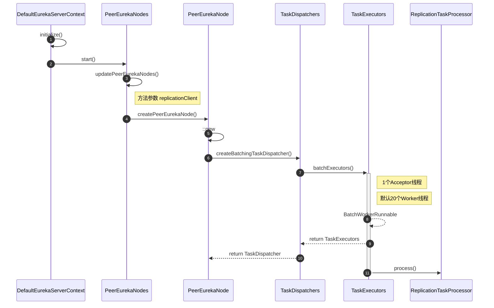
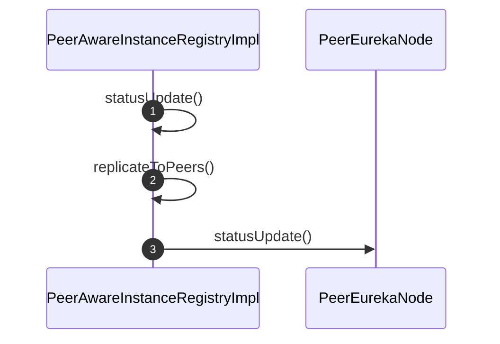
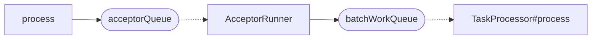

# Eureka学习笔记
> date: 202109
---

# 01 | 启动过程概述

切入点：`@EnableEurekaServer`注解：



`EurekaServerMarkerConfiguration`源码如下：

```java
/**
 * Responsible for adding in a marker bean to activate
 * {@link EurekaServerAutoConfiguration}
 *
 * @author Biju Kunjummen
 */
@Configuration
public class EurekaServerMarkerConfiguration {

	@Bean
	public Marker eurekaServerMarkerBean() {
		return new Marker();
	}

	class Marker {
	}
}
```

注释：`EurekaServerAutoConfiguration`

```java
@Configuration
@Import(EurekaServerInitializerConfiguration.class)
@ConditionalOnBean(EurekaServerMarkerConfiguration.Marker.class)
@EnableConfigurationProperties({ EurekaDashboardProperties.class,
		InstanceRegistryProperties.class })
@PropertySource("classpath:/eureka/server.properties")
```

初始化：`EurekaServerInitializerConfiguration`

```java
@Override
public void start() {
    new Thread(new Runnable() {
        @Override
        public void run() {
            try {
                // 启动服务
                eurekaServerBootstrap.contextInitialized(EurekaServerInitializerConfiguration.this.servletContext);
                log.info("Started Eureka Server");
                // eureka注册中心启动事件
                publish(new EurekaRegistryAvailableEvent(getEurekaServerConfig()));
                EurekaServerInitializerConfiguration.this.running = true;
                // eureka server启动事件
                publish(new EurekaServerStartedEvent(getEurekaServerConfig()));
            }
            catch (Exception ex) {
                // Help!
                log.error("Could not initialize Eureka servlet context", ex);
            }
        }
    }).start();
}
```

> Eureka 未对`EurekaRegistryAvailableEvent`和`EurekaServerStartedEvent`事件进行消费，可根据需要监听实现自定义业务逻辑。

# 02 | Eureka 节点同步机制

## 2.1 服务启动过程

切入点：

```log
ReplicationTaskProcessor.java 96: It seems to be a socket read timeout exception, it will retry later. if it continues to happen and some eureka node occupied all the cpu time, you should set property 'eureka.server.peer-node-read-timeout-ms' to a bigger value
```



## 2.2 节点同步过程

参考：


切入点：

```java
PeerEurekaNode # statusUpdate()
```

`PeerEurekaNode`对象在服务启动后，会在构造器内初始化`batchingDispatcher`，该成员会在`statusUpdate`、`heartbeat`、`register`等方法内使用。

触发点？



## 2.3 Acceptor Worker 工作原理

切入点：

```
TaskDispatchers # createBatchingTaskDispatcher()
```

> 该方法里有一行调用：`acceptorExecutor.process(id, task, expiryTime)`。

工作原理如下：



如何从`acceptorQueue`中消费任务？

```
AcceptorRunner # run()
-> assignBatchWork()
```

```
TaskExecutors # run()
-> getWork() // 从队列里取任务
-> TaskProcessor # process()
```

一路跟踪后，`taskProcessor`在`PeerEurekaNode`构造函数里初始化了：

```java
ReplicationTaskProcessor taskProcessor = new ReplicationTaskProcessor(targetHost, replicationClient);
// replicationClient 是 JerseyReplicationClient 的对象
```

# 03 | Eureka Server Docker

**1. 下载 jdk**

```shell
docker pull casstime/alpine-glibc-server-jre-8:latest
```

**2. 编写 Dockerfile**

```dockerfile
FROM casstime/alpine-glibc-server-jre-8:latest
COPY eureka-server.jar /opt
ENTRYPOINT java $JAVA_OPTS -jar /opt/eureka-server.jar
```

**3. 构建镜像**

```shell
docker build -t eureka-server:release-1.0 .
```

> 删除镜像：`docker rmi ${IMAGE_ID}`

**4. 启动**

```shell
docker run -d --name eureka-server-1 -p 8761:8761 -e JAVA_OPTS='-Dserver.port=8761 -Deureka.instance.hostname=eureka-server-1 -Deureka.client.serviceUrl.defaultZone=http://10.118.32.170:8761/eureka,http://10.118.32.170:8762/eureka,http://10.118.32.170:8763/eureka' eureka-server:release-1.0
```


