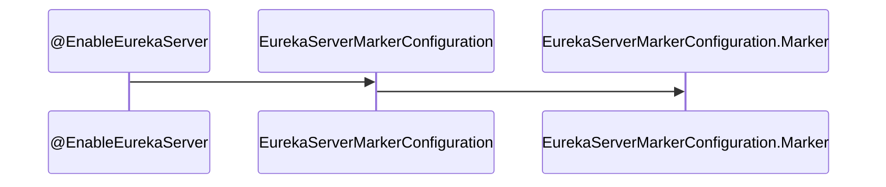

# 01 | 启动过程概述

切入点：`@EnableEurekaServer`注解：



`EurekaServerMarkerConfiguration`源码如下：

```java
/**
 * Responsible for adding in a marker bean to activate
 * {@link EurekaServerAutoConfiguration}
 *
 * @author Biju Kunjummen
 */
@Configuration
public class EurekaServerMarkerConfiguration {

	@Bean
	public Marker eurekaServerMarkerBean() {
		return new Marker();
	}

	class Marker {
	}
}
```

注释：`EurekaServerAutoConfiguration`

```java
@Configuration
@Import(EurekaServerInitializerConfiguration.class)
@ConditionalOnBean(EurekaServerMarkerConfiguration.Marker.class)
@EnableConfigurationProperties({ EurekaDashboardProperties.class,
		InstanceRegistryProperties.class })
@PropertySource("classpath:/eureka/server.properties")
```

初始化：`EurekaServerInitializerConfiguration`

```java
@Override
public void start() {
    new Thread(new Runnable() {
        @Override
        public void run() {
            try {
                // 启动服务
                eurekaServerBootstrap.contextInitialized(EurekaServerInitializerConfiguration.this.servletContext);
                log.info("Started Eureka Server");
                // eureka注册中心启动事件
                publish(new EurekaRegistryAvailableEvent(getEurekaServerConfig()));
                EurekaServerInitializerConfiguration.this.running = true;
                // eureka server启动事件
                publish(new EurekaServerStartedEvent(getEurekaServerConfig()));
            }
            catch (Exception ex) {
                // Help!
                log.error("Could not initialize Eureka servlet context", ex);
            }
        }
    }).start();
}
```

> Eureka 未对`EurekaRegistryAvailableEvent`和`EurekaServerStartedEvent`事件进行消费，可根据需要监听实现自定义业务逻辑。

# 02 | Eureka服务启动

切入点：

```java
eurekaServerBootstrap.contextInitialized(EurekaServerInitializerConfiguration.this.servletContext);
```

```java
public void contextInitialized(ServletContext context) {
    try {
        // 初始化环境
        initEurekaEnvironment();
        initEurekaServerContext();
        context.setAttribute(EurekaServerContext.class.getName(), this.serverContext);
    }
    catch (Throwable e) {
        log.error("Cannot bootstrap eureka server :", e);
        throw new RuntimeException("Cannot bootstrap eureka server :", e);
    }
}
```


